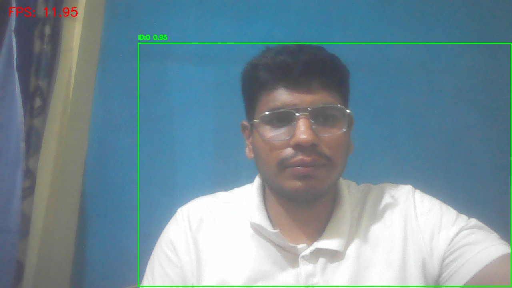

# Autonomous Drone Perception System

> Real-time computer vision perception pipeline for autonomous drone and robotics applications using YOLOv8, OpenCV, and PyTorch.

---

# Project Vision

This project aims to build a scalable perception foundation for future autonomous drone systems capable of:

- real-time environmental understanding,
- object awareness,
- temporal reasoning,
- probabilistic motion estimation,
- and autonomous navigation support.

The current implementation focuses on building the **core visual perception layer** required in robotics and UAV systems.

Rather than building a monolithic demo, the project is being developed incrementally using modular research-oriented engineering principles.

---

# Why This Project Exists

Modern UAVs and autonomous robotic systems require perception pipelines that can:

- process visual data in real time,
- operate under noisy environments,
- handle latency constraints,
- detect dynamic objects,
- and eventually support autonomous decision-making.

This repository represents the early-stage development of such a system.

The long-term goal is to evolve this project into a complete autonomous perception and navigation stack integrating:

- multi-object tracking,
- Kalman filtering,
- ROS2,
- trajectory prediction,
- simulation environments,
- and edge AI deployment.

---

# Current Development Stage

Current project maturity:

```text
Stage 1:
Real-Time Visual Perception Prototype
```

Implemented capabilities:

- real-time object detection,
- webcam inference,
- FPS monitoring,
- runtime logging,
- screenshot generation,
- video recording,
- modular architecture.

Not yet implemented:

- object tracking,
- temporal reasoning,
- state estimation,
- SLAM,
- autonomous navigation,
- obstacle avoidance.

---

# System Architecture

## Current Pipeline

```text
Camera Stream
        ↓
Frame Acquisition Layer
        ↓
YOLOv8 Detection Engine
        ↓
Detection Parsing
        ↓
Visualization Layer
        ↓
Runtime Logging
        ↓
Benchmark Artifact Generation
```

---

# Future Expanded Architecture

```text
Camera Stream
        ↓
Detection Pipeline
        ↓
Multi-Object Tracking
        ↓
Kalman Filtering
        ↓
Trajectory Prediction
        ↓
Navigation Logic
        ↓
ROS2 Communication
        ↓
Autonomous UAV Control
```

---

# Key Features

# 1. Real-Time Object Detection

The system performs real-time inference using:

- YOLOv8
- OpenCV
- PyTorch

Capabilities:

- webcam stream processing,
- bounding-box rendering,
- confidence score visualization,
- low-latency inference.

---

# 2. Runtime Monitoring & Logging

The pipeline continuously records:

- FPS values,
- detection statistics,
- runtime events,
- initialization states,
- system shutdown events.

This supports:
- experiment reproducibility,
- debugging,
- and future benchmark analysis.

---

# 3. Experiment Artifact Generation

The project automatically generates:

## Screenshots

Stored in:

```text
outputs/screenshots/
```

Used for:
- qualitative evaluation,
- README visualization,
- benchmark evidence.

---

## Output Videos

Stored in:

```text
outputs/videos/
```

Used for:
- replay analysis,
- performance review,
- demonstration purposes.

---

## Runtime Logs

Stored in:

```text
logs/system.log
```

Used for:
- FPS analysis,
- runtime verification,
- experiment tracking.

---

# Repository Structure

```text
autonomous_drone_system/

├── benchmarks/
│
├── configs/
│   └── system.yaml
│
├── datasets/
│
├── docs/
│
├── experiments/
│
├── logs/
│
├── outputs/
│   ├── screenshots/
│   └── videos/
│
├── src/
│   ├── camera/
│   │   └── webcam_stream.py
│   │
│   ├── detection/
│   │   └── yolo_detector.py
│   │
│   └── utils/
│       ├── fps.py
│       ├── logger.py
│       └── visualizer.py
│
├── tests/
│
├── main.py
├── requirements.txt
└── README.md
```

---

# Core Technologies

| Area | Technology |
|---|---|
| Deep Learning | PyTorch |
| Detection Engine | YOLOv8 |
| Computer Vision | OpenCV |
| Numerical Computing | NumPy |
| Logging | Python Logging |
| Visualization | OpenCV Rendering |
| Environment | Python 3.11 |

---

# Detection Pipeline

The current perception pipeline performs:

## Step 1 — Frame Acquisition

Frames are captured from the webcam stream using OpenCV.

---

## Step 2 — YOLOv8 Inference

Each frame is passed through the YOLOv8 detection model.

The model predicts:

- bounding boxes,
- confidence scores,
- object classes.

---

## Step 3 — Detection Parsing

Detection outputs are converted into structured dictionaries containing:

```python
{
    "bbox": [x1, y1, x2, y2],
    "confidence": 0.94,
    "class_id": 0
}
```

---

## Step 4 — Visualization

Detected objects are rendered on frames using:

- bounding boxes,
- labels,
- confidence values,
- FPS overlays.

---

## Step 5 — Runtime Logging

The system records:
- FPS,
- detection counts,
- runtime behavior.

Example:

```text
2026-05-23 03:43:13 | INFO | Detections: 1
2026-05-23 03:43:13 | INFO | FPS: 19.21
```

---

# Runtime Observations

Observed runtime behavior:

| Scenario | Approx FPS |
|---|---|
| Single Object Scene | 18–22 FPS |
| Multi-Object Scene | 10–16 FPS |
| Heavy Scene Complexity | FPS reduction |
| CPU-only Inference | Stable |
| Low-Light Conditions | Detection instability |

---

# Failure Analysis

The current system demonstrates several expected limitations.

## Motion Blur

Fast camera movement introduces:
- unstable detections,
- missed objects,
- reduced confidence.

---

## Low Lighting

Performance decreases significantly under:
- dim environments,
- poor illumination,
- noisy frames.

---

## Small Distant Objects

Small-scale targets are harder to detect consistently due to:
- limited pixel resolution,
- reduced feature visibility.

---

## Occlusion

Partial object occlusion may lead to:
- temporary missed detections,
- inconsistent localization.

---

# Example Runtime Outputs

# Detection Screenshots

Example generated screenshots:

```md

```

---

# Runtime Logs

Example log entries:

```text
2026-05-23 03:43:12 | INFO | System initialized
2026-05-23 03:43:13 | INFO | YOLO model loaded
2026-05-23 03:43:13 | INFO | FPS: 19.21
2026-05-23 03:43:13 | INFO | Detections: 1
```

---

# Current Technical Limitations

The system currently lacks:

- temporal object tracking,
- persistent object identities,
- motion estimation,
- trajectory prediction,
- probabilistic filtering,
- depth estimation,
- SLAM,
- robotics middleware,
- autonomous navigation.

Therefore this repository should currently be interpreted as:

```text
real-time perception prototype
```

rather than a complete autonomous UAV stack.

---

# Planned Research Extensions

Future planned modules include:

## Multi-Object Tracking

- ByteTrack
- DeepSORT

---

## State Estimation

- Kalman Filter
- Extended Kalman Filter

---

## Robotics Middleware

- ROS2 integration
- sensor communication
- modular robotics nodes

---

## Simulation

- AirSim
- Gazebo

---

## Edge AI Deployment

- TensorRT optimization
- ONNX conversion
- Jetson deployment

---

## Navigation

- target following,
- obstacle avoidance,
- trajectory planning.

---

# Installation

# Clone Repository

```bash
git clone https://github.com/sourabhwarrior2003/autonomous-drone-perception-system.git

cd autonomous-drone-perception-system
```

---

# Create Virtual Environment

## Windows

```bash
python -m venv venv

.\venv\Scripts\Activate.ps1
```

---

## Linux/macOS

```bash
python3 -m venv venv

source venv/bin/activate
```

---

# Install Dependencies

```bash
pip install -r requirements.txt
```

---

# Run System

```bash
python main.py
```

---

# Generated Runtime Artifacts

During execution the system automatically generates:

| Artifact | Location |
|---|---|
| Runtime Logs | logs/ |
| Screenshots | outputs/screenshots/ |
| Output Videos | outputs/videos/ |

---

# Research Engineering Goals

This project is part of a broader learning and research direction involving:

- robotics perception systems,
- autonomous UAV intelligence,
- computer vision pipelines,
- real-time AI systems,
- and probabilistic state estimation.

---

# Current Repository Status

Current maturity level:

```text
Research-Oriented Perception Prototype
```

Strong aspects:
- modular design,
- reproducible setup,
- runtime instrumentation,
- logging infrastructure,
- experiment artifact generation.

Future work will focus on:
- temporal intelligence,
- tracking systems,
- robotics integration,
- and autonomous navigation capabilities.

---

# License

MIT License